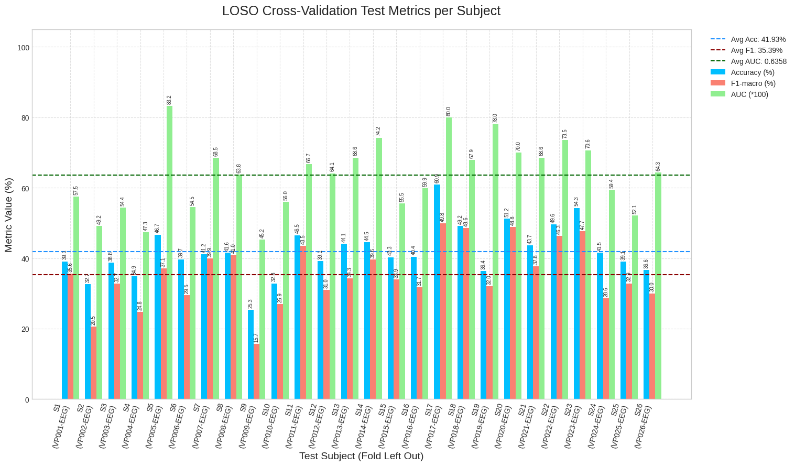

# Adaptação do EEG-PatchFormer para Classificação de Tarefas Cognitivas (N-back, DSR, WG)

Este repositório contém uma adaptação do modelo EEG-PatchFormer para a classificação de três estados cognitivos distintos (N-back, Driving Scene Recognition, Word Generation) a partir de sinais EEG. O trabalho envolveu o pré-processamento de um dataset público, a modificação da arquitetura do modelo original, e a implementação de um pipeline de treinamento e avaliação robusto utilizando validação cruzada Leave-One-Subject-Out (LOSO CV).

## Visão Geral do Projeto

O objetivo principal foi aplicar e avaliar a arquitetura EEG-PatchFormer em um cenário de classificação multiclasse com dados EEG. O processo incluiu:
1.  Obtenção e pré-processamento dos dados EEG.
2.  Adaptação da implementação do EEG-PatchFormer para compatibilidade com as características do dataset.
3.  Desenvolvimento de um script de treinamento principal (`main.py`) com capacidade de executar validação cruzada LOSO CV.
4.  Cálculo de múltiplas métricas de avaliação (Acurácia, AUC, F1-macro) e geração de visualizações dos resultados.
5.  Plotagem dos resultados

## Dataset Utilizado

Os experimentos foram conduzidos utilizando o dataset público:
*   **Fonte:** Simultaneous acquisition of EEG and NIRS during cognitive tasks for an open access dataset ([Link para o dataset](https://www.nature.com/articles/sdata20183/))
*   **Características Utilizadas:**
    *   Tarefas: N-back (`nback`), Driving Scene Recognition (`dsr`), Word Generation (`wg`).
    *   Número de Sujeitos: 26.
    *   Número de Canais EEG: 30 (selecionados a partir dos 61 originais durante o pré-processamento).
    *   Frequência de Amostragem: 200 Hz.

## Estrutura do Repositório e Arquivos

*   **Script de Pré-processamento (ex: `upload-to-data-drive.py`):**
    *   Responsável por carregar os arquivos `.mat` originais do dataset.
    *   Extrai os sinais EEG (30 canais selecionados), informações de amostragem (200 Hz) e rótulos de tarefa.
    *   Aplica filtragem de frequência (passa-banda 1-40 Hz e notch 50/60 Hz) para remoção de ruído.
    *   Salva os dados processados em um arquivo `eeg_data.pkl`.

*   **`eeg-path-former-adaptation.py`:**
    *   Contém a definição da arquitetura do modelo EEG-PatchFormer adaptada.
    *   Define as classes do modelo: `PatchFormer`, `Patcher`, `Attention`, `Transformer`.
    *   Modificações foram feitas para garantir a compatibilidade dimensional com os dados processados e para corrigir a lógica de cálculo de padding e número de patches.
    **Repositório original:** EEGPathFormer ([Link para o dataset](https://github.com/yi-ding-cs/EEG-PatchFormer))

*   **`main.py`:**
    *   Script principal para treinamento e avaliação utilizando validação cruzada LOSO CV.
    *   Utiliza `argparse` para configuração de hiperparâmetros.
    *   Para cada um dos 26 sujeitos:
        *   O sujeito é isolado como conjunto de teste.
        *   Os 25 sujeitos restantes são divididos em treino (80%) e validação interna (20%).
        *   Um novo modelo EEG-PatchFormer é treinado e o melhor estado (baseado na métrica de validação interna, ex: AUC) é salvo.
        *   O melhor modelo do fold é avaliado no sujeito de teste.
    *   Calcula e exibe métricas médias (Acurácia, AUC, F1-macro) e seus desvios padrão ao final de todos os folds.
    *   Gera gráficos das métricas de validação por época para cada fold e um gráfico resumo das métricas de teste finais.

*   **`plot_loso_results.py` (Opcional/Exemplo):**
    *   Script auxiliar para carregar resultados de um arquivo de texto (gerado a partir dos logs) e plotar a tabela e o gráfico resumo das métricas de teste finais da LOSO CV.

## Como Executar

1.  **Pré-requisitos:**
    *   Python 3.x
    *   PyTorch
    *   scikit-learn
    *   NumPy
    *   Matplotlib
    *   einops
    *   Pandas (para o script de plotagem)

2.  **Preparação dos Dados:**
    *   Baixe o dataset "EEG N-back/DSR/WG".
    *   Execute seu script de pré-processamento para gerar o `eeg_data.pkl` com os dados dos 26 sujeitos, 30 canais, fs=200Hz e filtros aplicados.

3.  **Treinamento e Avaliação (LOSO CV):**
    *   Execute o script `main_modified.py`. Ajuste os hiperparâmetros conforme necessário via linha de comando.
    *   Exemplo de comando utilizado para obter os resultados apresentados:
        ```bash
        python main_modified.py \
            --data_path /content/drive/MyDrive/EEG_data/eeg_data.pkl \
            --epochs_per_fold 200 \ # Ou o número de épocas que você rodou (ex: 50, 100)
            --batch_size 32 \
            --lr 5e-5 \
            --weight_decay 1e-3 \
            --dropout_rate 0.6 \
            --depth 2 \
            --heads 4 \
            --dim_head 32 \
            --num_T 16 \
            --patch_time 20 \
            --patch_step 10 \
            --window_size 800 \
            --step_size 400 \
            --sampling_rate 200 \
            --num_classes 3 \
            --log_interval 100 \
            --save_path ./run_26_subjects \
            --metric_to_optimize AUC \
            --use_scheduler \
            --scheduler_patience 5 \
            --early_stopping_patience 10 \
            --plot_fold_metrics
        ```

## Resultados

A avaliação do modelo utilizando validação cruzada Leave-One-Subject-Out (LOSO CV) em 26 sujeitos do dataset TU Berlin N-back/DSR/WG forneceu as seguintes métricas de desempenho médias no conjunto de teste:

*   **Acurácia Média:** 41.93% (± 7.25%)
*   **F1-macro Médio:** 35.39% (± 8.64%)
*   **AUC Média:** 0.6358 (± 0.0993)

Esses resultados indicam que o modelo EEG-PatchFormer adaptado é capaz de aprender padrões generalizáveis para a classificação das três tarefas cognitivas, superando o desempenho aleatório (que seria ~33.3% para acurácia). No entanto, a variabilidade considerável no desempenho entre os sujeitos (conforme detalhado abaixo e no gráfico) sugere que a eficácia do modelo é heterogênea. Alguns sujeitos apresentaram desempenho notavelmente superior (e.g., VP017 com AUC de 0.8001), enquanto para outros o desempenho foi próximo ou abaixo do acaso.

### Métricas de Teste Individuais por Fold (Sujeito)

| Fold | Test Subject | Accuracy (%) | F1-macro (%) |   AUC  |
|:----:|:-------------|:------------:|:------------:|:------:|
|  1   | VP001-EEG    |    39.11     |    35.57     | 0.5752 |
|  2   | VP002-EEG    |    32.68     |    20.53     | 0.4916 |
|  3   | VP003-EEG    |    38.76     |    32.72     | 0.5440 |
|  4   | VP004-EEG    |    34.91     |    24.75     | 0.4732 |
|  5   | VP005-EEG    |    46.68     |    37.07     | 0.8320 |
|  6   | VP006-EEG    |    39.70     |    29.52     | 0.5453 |
|  7   | VP007-EEG    |    41.16     |    39.90     | 0.6853 |
|  8   | VP008-EEG    |    41.56     |    40.99     | 0.6379 |
|  9   | VP009-EEG    |    25.28     |    15.65     | 0.4523 |
|  10  | VP010-EEG    |    32.84     |    26.92     | 0.5603 |
|  11  | VP011-EEG    |    46.54     |    43.45     | 0.6672 |
|  12  | VP012-EEG    |    39.13     |    31.02     | 0.6411 |
|  13  | VP013-EEG    |    44.10     |    34.28     | 0.6856 |
|  14  | VP014-EEG    |    44.54     |    39.63     | 0.7422 |
|  15  | VP015-EEG    |    40.28     |    33.92     | 0.5554 |
|  16  | VP016-EEG    |    40.44     |    31.74     | 0.5992 |
|  17  | VP017-EEG    |    60.85     |    49.84     | 0.8001 |
|  18  | VP018-EEG    |    49.20     |    48.58     | 0.6787 |
|  19  | VP019-EEG    |    36.37     |    31.99     | 0.7799 |
|  20  | VP020-EEG    |    51.19     |    48.82     | 0.6995 |
|  21  | VP021-EEG    |    43.66     |    37.75     | 0.6856 |
|  22  | VP022-EEG    |    49.61     |    46.31     | 0.7351 |
|  23  | VP023-EEG    |    54.29     |    47.66     | 0.7064 |
|  24  | VP024-EEG    |    41.53     |    28.55     | 0.5941 |
|  25  | VP025-EEG    |    39.08     |    32.85     | 0.5209 |
|  26  | VP026-EEG    |    36.60     |    30.03     | 0.6429 |

### Visualização dos Resultados de Teste por Fold


*(Substitua `./run_26_subjects/loso_summary_test_metrics.png` pelo caminho correto para o seu gráfico gerado, ou incorpore a imagem diretamente se o seu ambiente Markdown permitir)*

## Discussão e Próximos Passos

Os resultados demonstram o potencial da arquitetura, mas a variabilidade inter-sujeito destaca a necessidade de melhorias. Futuras direções incluem:
*   Ajuste fino de hiperparâmetros mais exaustivo.
*   Técnicas de pré-processamento de EEG mais avançadas (ex: ICA, normalização por sujeito).
*   Exploração de diferentes estratégias de patching ou componentes do modelo.
*   Aumento da complexidade do modelo (com cautela para evitar overfitting) se os dados permitirem.
*   Investigação de métodos de adaptação de domínio ou personalização de modelo por sujeito.

## Contribuições

Reges Hengen - Universidade da Beira Interior